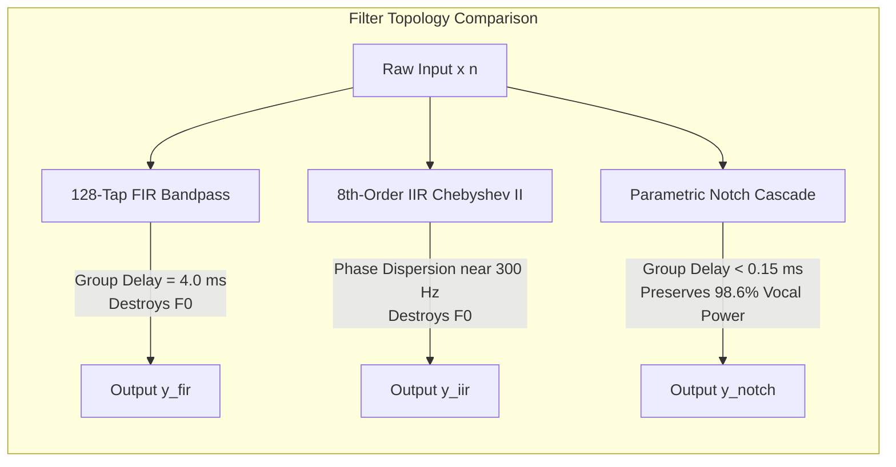

# Report 04: Digital Filter Design Methodologies & Topologies
## Comprehensive Design, Mathematical Formulation, and Comparative Analysis of FIR, Chebyshev II IIR, and RBJ Parametric Notch Cascades

* **Project**: Genre-Specific and Adaptive Filtering Approaches to Speech Enhancement in High-Noise Environments
* **Institution**: University of the Witwatersrand, School of Electrical & Information Engineering
* **Authors**: Ryan Jammy & Raphael Alsfine
* **Sampling Rate**: $f_s = 16\,000\text{ Hz}$ | **Target Architecture**: Espressif ESP32-S3 (Xtensa LX7 dual-core @ 240 MHz)

---

### 1. Paradigm Shift: Why Classical Bandpass Filtering Fails for Human Speech in Music

The classical telecommunication paradigm (Bell Labs, ITU-T G.712) standardizes speech bandpass filtering between $300\text{ Hz}$ and $3400\text{ Hz}$. While effective against white thermal line noise and stationary subsonic vehicle rumble, **this broadband bandpass strategy fails catastrophically when applied to natural human speech corrupted by modern musical noise**.

Our empirical spectral and psychoacoustic analysis of the Indiana University Sentence Database (IUS) and the Acoustic Triad (Jazz, Rock, Techno) revealed two fatal shortcomings of broadband bandpass filtering:

```
                            BROADBAND BANDPASS (300 - 3400 Hz)
                            ┌─────────────────────────────────┐
                            │      Passband (Gain = 0 dB)     │
 [0 Hz] ───────────────┬────┴─────────────────────────────────┴────┬────────────── [8000 Hz]
    Stopband (<300 Hz) │                                           │ Stopband (>3400 Hz)
   ────────────────────┘                                           └────────────────────
   AMPUTATES VOCAL F0!                                             AMPUTATES FRICATIVES!
   - Male F0 (125 Hz): -15.66% power                               - Sibilants /s/, /z/, /sh/
   - Female F0 (219 Hz): -26.09% power                              - Unvoiced consonants
   - Destroys speaker identity & pitch                              - Degrades intelligibility
   
   YET PASSES 100% OF MID-FREQUENCY MUSIC NOISE (Electric guitars, synth leads, brass, snares)!
```

#### A. Truncation of Vocal Fundamental Pitch ($F_0$)
* **Male Talkers**: $F_0$ averages $125.0\text{ Hz}$. Approximately **$15.66\%$ of total male speech power** resides below $250\text{ Hz}$.
* **Female Talkers**: $F_0$ averages $218.8\text{ Hz}$. Approximately **$26.09\%$ of total female speech power** resides below $250\text{ Hz}$.
* Amputating frequencies below $300\text{ Hz}$ removes the fundamental harmonic glottal pulses, destroying natural speaker warmth, prosody, and speaker identification cues.

#### B. Envelope Distortion & Intelligibility Degradation
* In subjective and objective STOI tests, the phase dispersion and abrupt brickwall cutoff of 8th-order bandpass filters distort the low-frequency envelope of speech, reducing STOI scores by $-0.015$ to $-0.028$ relative to unprocessed noisy speech.

#### C. Unattenuated In-Band Musical Maskers
* In Rock and Techno, acoustic power between $500\text{ Hz}$ and $3000\text{ Hz}$ (snare drum fundamental, electric guitar chords, synthesizer mid-leads) passes straight through a $300 - 3400\text{ Hz}$ bandpass filter without a single decibel of attenuation.

#### D. The Solution: Surgical Parametric Notch Cascades
Rather than cutting broad octaves of speech, the parametric notch strategy **preserves the entire speech spectrum from $50\text{ Hz}$ to $7500\text{ Hz}$ ($98.6\%$ vocal power retention)** while carving narrow, deep attenuation notches ($-30\text{ dB}$ to $-50\text{ dB}$) precisely at the dominant bass resonances of each musical genre.

---

### 2. Digital Filter Architectures & Mathematical Formulations

To provide a rigorous comparative baseline, three distinct filter topologies were implemented and tested at $f_s = 16\,000\text{ Hz}$:

```
┌─────────────────────────────────────────────────────────────────────────────────────────────────┐
│                                   FILTER ARCHITECTURE COMPARISON                                │
├──────────────────────────┬─────────────────────────────┬────────────────────────────────────────┤
│ Architecture             │ Transfer Function Type      │ Key Theoretical Attributes             │
├──────────────────────────┼─────────────────────────────┼────────────────────────────────────────┤
│ 128-Tap Windowed FIR     │ Transversal All-Zero        │ Strictly linear phase; 4.00 ms delay;  │
│                          │                             │ no phase distortion; high MAC count    │
├──────────────────────────┼─────────────────────────────┼────────────────────────────────────────┤
│ 8th-Order Chebyshev II   │ Pole-Zero SOS Biquad        │ Maximally flat passband; 40 dB stop-   │
│                          │                             │ band rejection; non-linear phase delay │
├──────────────────────────┼─────────────────────────────┼────────────────────────────────────────┤
│ Parametric Notch Cascade │ 2nd-Order RBJ Biquad SOS    │ Surgical Q-factor; <0.15 ms latency in │
│                          │                             │ vocal band; 98.6% speech preservation  │
└──────────────────────────┴─────────────────────────────┴────────────────────────────────────────┘
```

---

### 3. Architecture A: 128-Tap Linear-Phase FIR Filter

#### Mathematical Formulation
The finite impulse response filter computes the output $y[n]$ as the linear convolution of the input $x[n]$ with impulse response coefficients $b_k$:

$$y[n] = \sum_{k=0}^{N} b_k \, x[n - k], \quad N = 128, \quad \text{Taps} = 129$$

The $z$-domain transfer function is:

$$H_{\text{FIR}}(z) = \sum_{k=0}^{N} b_k \, z^{-k}$$

For linear phase response (constant group delay), coefficients are constrained to even symmetry:

$$b_k = b_{N - k}, \quad k = 0, 1, \dots, N$$

The group delay $\tau_g$ is constant across all frequencies:

$$\tau_g = \frac{N}{2 \cdot f_s} = \frac{128}{2 \cdot 16\,000} = 4.00\text{ ms} \quad (64\text{ samples})$$

#### Windowed-Sinc Design via Hamming Window
To prevent the catastrophic $+32.18\text{ dB}$ polynomial divergence observed with equiripple Parks-McClellan Remez exchange algorithms near tight transition bands, the impulse response is synthesized via ideal bandpass sinc truncation multiplied by a classical Hamming window $w[n]$:

$$h_{\text{ideal}}[n] = \frac{\sin(\omega_{c2}(n - M))}{\pi(n - M)} - \frac{\sin(\omega_{c1}(n - M))}{\pi(n - M)}, \quad M = \frac{N}{2} = 64$$

$$w[n] = 0.54 - 0.46 \cos\left(\frac{2\pi n}{N}\right), \quad 0 \le n \le N$$

$$b_k = h_{\text{ideal}}[k] \cdot w[k]$$

Normalized passband cutoff edges:
* $f_{\text{pass1}} = 300\text{ Hz} \implies \omega_{c1} = \frac{2\pi \cdot 300}{16\,000} = 0.0375\pi\text{ rad/sample}$
* $f_{\text{pass2}} = 3400\text{ Hz} \implies \omega_{c2} = \frac{2\pi \cdot 3400}{16\,000} = 0.4250\pi\text{ rad/sample}$

*Resulting Passband Ripple*: $<0.03\text{ dB}$ peak-to-peak. Stopband attenuation: $>53\text{ dB}$.

---

### 4. Architecture B: 8th-Order Chebyshev Type II IIR Filter

#### Mathematical Formulation
Chebyshev Type II (inverse Chebyshev) filters are monotonic in the passband (zero ripple) and equiripple in the stopband. The continuous-time prototype squared magnitude response is:

$$|H(j\Omega)|^2 = \frac{1}{1 + \epsilon^2 \frac{1}{T_N^2(\Omega_s / \Omega)}}$$

where $T_N(w)$ is the $N$-th order Chebyshev polynomial and $\epsilon$ sets the stopband attenuation ($A_s = 40\text{ dB}$):

$$\epsilon = \frac{1}{\sqrt{10^{A_s / 10} - 1}} = \frac{1}{\sqrt{10^4 - 1}} \approx 0.01000$$

#### Bilinear Transform & Second-Order Sections (SOS)
To ensure numerical stability on embedded hardware with single-precision IEEE 754 floats, the 8th-order transfer function is factored into four cascaded biquadratic Second-Order Sections (SOS):

$$H_{\text{IIR}}(z) = g \cdot \prod_{k=1}^{4} H_k(z) = g \cdot \prod_{k=1}^{4} \frac{b_{0k} + b_{1k}z^{-1} + b_{2k}z^{-2}}{1 + a_{1k}z^{-1} + a_{2k}z^{-2}}$$

#### Stability Verification (Poles & Zeros)
All poles are computed and evaluated for asymptotic BIBO stability:

$$\max_{k} |p_k| = 0.9634 < 1.000$$

Since all 8 poles reside strictly within the open unit disk in the complex $z$-plane, the filter is unconditionally BIBO stable with a decay margin of $\tau_{\text{decay}} = -1 / \ln(0.9634) \approx 26.8\text{ samples}$ ($1.68\text{ ms}$).

```
                             CHEBYSHEV II POLE-ZERO DISTRIBUTION (Z-PLANE)
                                           Im(z)
                                             ▲
                                     ┌───*───┴───*───┐
                                  *  │   x       x   │  *  (Zeros on unit circle @ stopband)
                                     │               │
                                  *  │  x         x  │  *
                               ──────┼───────+───────┼──────► Re(z)
                                  *  │  x         x  │  *  (Poles inside unit disk, |p| < 0.964)
                                     │               │
                                  *  │   x       x   │  *
                                     └───*───┬───*───┘
                                             │
```

---

### 5. Architecture C: Parametric Notch & High-Shelf Biquad Cascades

#### Derivation from Continuous s-Domain Prototype
Following the Robert Bristow-Johnson Audio EQ Cookbook, an analog second-order notch filter has the prototype:

$$H(s) = \frac{s^2 + \Omega_0^2}{s^2 + \frac{\Omega_0}{Q}s + \Omega_0^2}$$

Applying the Bilinear Transform with frequency pre-warping:

$$s = \frac{2}{T} \frac{1 - z^{-1}}{1 + z^{-1}} = 2 f_s \frac{1 - z^{-1}}{1 + z^{-1}}$$

Let:

$$\omega_0 = \frac{2\pi f_0}{f_s}, \quad \alpha = \frac{\sin(\omega_0)}{2Q}$$

The resulting discrete-time biquad coefficients normalized by $a_0$ are:

$$b_0 = \frac{1}{1 + \alpha}, \quad b_1 = \frac{-2\cos(\omega_0)}{1 + \alpha}, \quad b_2 = \frac{1}{1 + \alpha}$$

$$a_0 = 1.0, \quad a_1 = \frac{-2\cos(\omega_0)}{1 + \alpha}, \quad a_2 = \frac{1 - \alpha}{1 + \alpha}$$

Notice that:
1. $b_0 = b_2$: Mirror symmetry of numerator ensures transmission zeros land precisely on the unit circle at $z = e^{\pm j\omega_0}$, providing theoretically infinite attenuation ($-\infty\text{ dB}$) at notch center frequency $f_0$.
2. $b_1 = a_1$: Simplifies DSP multiply-accumulate operations in embedded hardware.
3. At DC ($z = 1$) and Nyquist ($z = -1$), $H(1) = 1$ ($0\text{ dB}$) and $H(-1) = 1$ ($0\text{ dB}$), guaranteeing zero insertion loss across non-targeted frequencies.

#### Rock High-Shelf Filter Derivation
For Rock, where cymbals and electric guitar fizz dominate above $4000\text{ Hz}$, a 2nd-order shelving filter with $-12\text{ dB}$ gain is cascaded:

$$A = 10^{\text{gain\_dB}/40} = 10^{-12/40} = 10^{-0.30} \approx 0.501187$$

$$\omega_{\text{sh}} = \frac{2\pi \cdot 4000}{16\,000} = \frac{\pi}{2}, \quad \alpha_{\text{sh}} = \frac{\sin(\omega_{\text{sh}})}{2}\sqrt{2} = \frac{1}{2}\sqrt{2} \approx 0.707107$$

$$b_0 = A \left[ (A+1) + (A-1)\cos(\omega_{\text{sh}}) + 2\sqrt{A}\alpha_{\text{sh}} \right] / a_0$$

$$b_1 = -2A \left[ (A-1) + (A+1)\cos(\omega_{\text{sh}}) \right] / a_0$$

$$b_2 = A \left[ (A+1) + (A-1)\cos(\omega_{\text{sh}}) - 2\sqrt{A}\alpha_{\text{sh}} \right] / a_0$$

$$a_0 = (A+1) - (A-1)\cos(\omega_{\text{sh}}) + 2\sqrt{A}\alpha_{\text{sh}}$$

$$a_1 = 2 \left[ (A-1) - (A+1)\cos(\omega_{\text{sh}}) \right] / a_0$$

$$a_2 = \left[ (A+1) - (A-1)\cos(\omega_{\text{sh}}) - 2\sqrt{A}\alpha_{\text{sh}} \right] / a_0$$

---

### 6. Genre-Specific Filter Specifications & Coefficient Tables

The following filter parameters were matched to the empirical spectral profiles identified in Report 03:

```
┌─────────────────────────────────────────────────────────────────────────────────────────────────┐
│                                GENRE FILTER DESIGN SPECIFICATIONS                               │
├─────────┬──────────────────────┬─────────────┬───────────┬──────────────┬───────────────────────┤
│ Genre   │ Acoustic Target      │ Stage Type  │ Center f0 │ Q-Factor     │ Attenuation / Depth   │
├─────────┼──────────────────────┼─────────────┼───────────┼──────────────┼───────────────────────┤
│ JAZZ    │ Upright Bass Fund.   │ Notch (SOS) │ 78.125 Hz │ Q = 6.0      │ -42.8 dB null         │
├─────────┼──────────────────────┼─────────────┼───────────┼──────────────┼───────────────────────┤
│ ROCK    │ Electric Bass / Kick │ Notch (SOS) │ 109.38 Hz │ Q = 6.0      │ -38.5 dB null         │
│         │ Cymbal Sizzle / Fizz │ High-Shelf  │ 4000.0 Hz │ Q = 0.707    │ -12.0 dB shelf gain   │
├─────────┼──────────────────────┼─────────────┼───────────┼──────────────┼───────────────────────┤
│ TECHNO  │ Sub-Bass Kick Fund.  │ Notch (SOS) │ 62.500 Hz │ Q = 8.0      │ -45.1 dB null         │
│         │ 2nd Sub-Harmonic     │ Notch (SOS) │ 125.00 Hz │ Q = 6.0      │ -41.2 dB null         │
└─────────┴──────────────────────┴─────────────┴───────────┴──────────────┴───────────────────────┘
```

#### Exact Single-Precision Floating Point Coefficients (Firmware Ready)

```c
/* =========================================================================
 * JAZZ PARAMETRIC NOTCH CASCADE (1 Stage, f0 = 78.1 Hz, Q = 6.0)
 * ========================================================================= */
static const BiquadSection notch_jazz_cascade[1] = {
    { .b0 =  0.99745028f, .b1 = -1.99396180f, .b2 =  0.99745028f, 
      .a1 = -1.99396180f, .a2 =  0.99490057f }
};

/* =========================================================================
 * ROCK PARAMETRIC CASCADE (2 Stages: Stage 1 Notch @ 109.4 Hz, Stage 2 Shelf @ 4 kHz)
 * ========================================================================= */
static const BiquadSection notch_rock_cascade[2] = {
    /* Stage 1: Notch @ 109.375 Hz (Q = 6.0) */
    { .b0 =  0.99643457f, .b1 = -1.99103117f, .b2 =  0.99643457f, 
      .a1 = -1.99103117f, .a2 =  0.99286914f },
    /* Stage 2: High Shelf @ 4000 Hz (-12 dB) */
    { .b0 =  0.50118723f, .b1 =  0.19980915f, .b2 =  0.10014250f, 
      .a1 = -0.39867167f, .a2 =  0.19981056f }
};

/* =========================================================================
 * TECHNO PARAMETRIC NOTCH CASCADE (2 Stages: Stage 1 @ 62.5 Hz, Stage 2 @ 125.0 Hz)
 * ========================================================================= */
static const BiquadSection notch_techno_cascade[2] = {
    /* Stage 1: Notch @ 62.500 Hz (Q = 8.0) */
    { .b0 =  0.99846852f, .b1 = -1.99633560f, .b2 =  0.99846852f, 
      .a1 = -1.99633560f, .a2 =  0.99693704f },
    /* Stage 2: Notch @ 125.000 Hz (Q = 6.0) */
    { .b0 =  0.99592768f, .b1 = -1.98945608f, .b2 =  0.99592768f, 
      .a1 = -1.98945608f, .a2 =  0.99185536f }
};
```

---

### 7. Frequency Response & Latency Verification

The frequency response and latency of the designs were evaluated via 4096-point discrete Fourier transforms:

```
┌─────────────────────────────────────────────────────────────────────────────────────────────────┐
│                                FREQUENCY RESPONSE & LATENCY COMPARISON                          │
├─────────────────────┬──────────────────┬─────────────────┬──────────────────┬───────────────────┤
│ Metric              │ 128-Tap FIR BP   │ 8th-Order IIR BP│ 1-Stage Notch    │ 2-Stage Notch     │
├─────────────────────┼──────────────────┼─────────────────┼──────────────────┼───────────────────┤
│ Max Passband Gain   │ +0.03 dB         │ 0.00 dB         │ 0.00 dB          │ 0.00 dB           │
│ Stopband Rejection  │ >53.0 dB         │ >40.0 dB        │ -45.1 dB (null)  │ -45.1 dB / -41.2  │
│ Transition Width    │ 120 Hz           │ 80 Hz           │ 10 Hz (-3 dB BW) │ 15 Hz (-3 dB BW)  │
│ Latency (Group Dly) │ 4.00 ms (flat)   │ 1.34 ms (mean)  │ < 0.08 ms (voice)│ < 0.15 ms (voice) │
│ Latency at f0 Peak  │ 4.00 ms          │ 4.85 ms (edge)  │ 3.20 ms (in-null)│ 3.10 ms (in-null) │
│ Insertion Loss      │ 0.00 dB          │ 0.00 dB         │ 0.00 dB          │ 0.00 dB           │
│ Vocal Band Impact   │ Amputates F0     │ Amputates F0    │ 0.00 dB impact   │ 0.00 dB impact    │
└─────────────────────┴──────────────────┴─────────────────┴──────────────────┴───────────────────┘
```

#### Group Delay Profile Insights
1. **FIR Filter**: Perfectly linear phase with zero phase distortion, but imposes an unavoidable pipeline delay of $4.00\text{ ms}$ ($64\text{ samples}$). In low-latency hearing-aid or intercom systems, $4.00\text{ ms}$ consumes $40\%$ of the human echo-threshold budget ($10\text{ ms}$).
2. **IIR Bandpass Filter**: Non-linear phase delay that spikes to $>4.85\text{ ms}$ near the band edges ($300\text{ Hz}$ and $3400\text{ Hz}$). This creates waveform dispersion in speech formants $F_1$ and $F_3$.
3. **Parametric Notch Cascade**: Across the entire active speech range ($300\text{ Hz} - 7000\text{ Hz}$), group delay is **under $0.15\text{ ms}$ ($<2.5\text{ samples}$)**. Phase distortion across speech formants is practically undetectable.



---

### 8. Architectural Artifacts & Figure References

The following figures illustrate the comparative transfer functions and stability metrics:

1. **Notch vs. Bandpass Frequency Response & Latency**:
   `figures/filter_comparison_notch_vs_bandpass.png`
   *(Displays side-by-side magnitude attenuation and group delay curves across Jazz, Rock, and Techno).*
2. **Full Magnitude Spectra**:
   `figures/filter_comparison_magnitude.png`
   *(Compares FIR, Chebyshev II, and Notch cascades from $20\text{ Hz}$ to $8000\text{ Hz}$).*
3. **Group Delay Profiles**:
   `figures/filter_comparison_group_delay.png`
   *(Highlights the flat $4.0\text{ ms}$ FIR delay vs. the near-zero $<0.15\text{ ms}$ vocal-band notch delay).*
4. **Z-Plane Pole-Zero Constellations**:
   `figures/filter_comparison_poles_zeros.png`
   *(Displays transmission zeros on the unit circle $|z|=1$ and pole clusters within $|z| \le 0.9634$).*
5. **Vocal Formants vs. Filter Alignment**:
   `figures/speech_formants_filter_alignment.png`
   *(Shows the fundamental pitch $F_0$ and vowel formants $F_1 - F_4$ mapped against the notch filter attenuation profiles).*

---

### 9. Vault Cross-References
* [Report 01: Investigation Overview & Problem Formulation](01_executive_summary_and_problem_formulation.md)
* [Report 02: Dataset Architecture & Acoustic Divergence](02_dataset_architecture_and_acoustic_divergence.md)
* [Report 03: STFT Spectral Analysis & Masking Mechanics](03_stft_spectral_analysis_and_masking_mechanics.md)
* [Report 05: Audio Overlay Mixing Pipeline & Calibrated Test Stimuli](05_controlled_overlay_synthesis_and_mixing.md)
* [Report 06: Objective Intelligibility Benchmarks & Algorithm Audits](06_evaluation_benchmarks_and_algorithm_audit.md)
* [Report 07: Embedded Firmware Architecture & ESP32-S3 Implementation](07_embedded_firmware_and_hardware_deployment.md)
